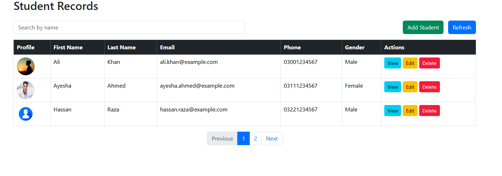
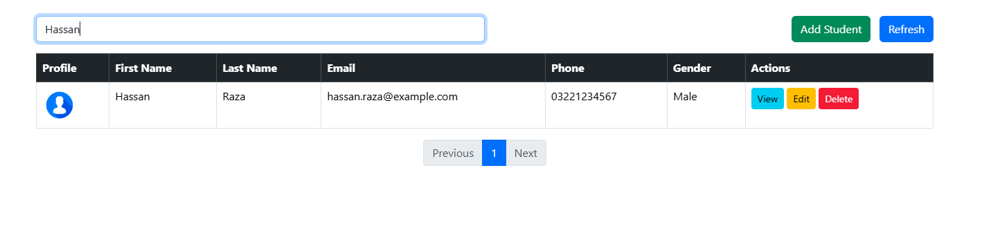
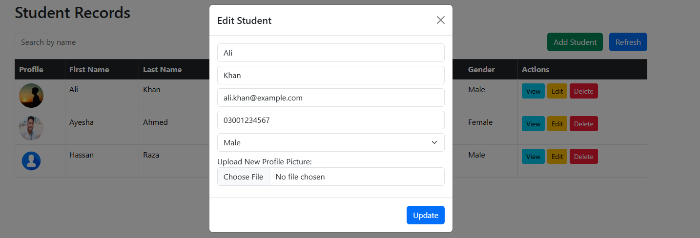
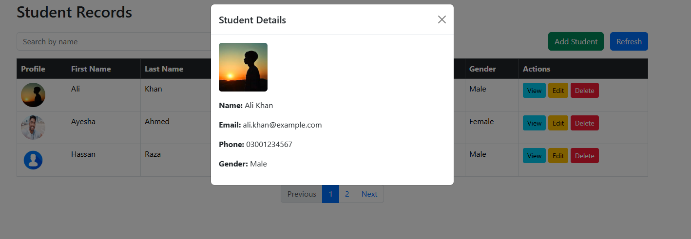

# FormOpsNode

FormOpsNode is a full-stack Node.js application designed to handle form-based data operations efficiently. It features a clean UI for managing records with full CRUD functionality.

## 📸 Project Screenshots

To give you a visual overview of the application, here are the core screens:

### 🖥️ Dashboard View
The main desktop interface where all records are listed.

### 🔍 Search & Filter
Efficiently find specific records using the built-in filtering system.

### 📝 Update Record
Modify existing data through a user-friendly modal/form.

### 👁️ Detailed View
In-depth view of individual record details.

---

## 🚀 Features
* **Create**: Add new form entries seamlessly.
* **Read**: View a complete list of records with detailed views.
* **Update**: Edit and update existing information in real-time.
* **Delete**: Remove records from the database.
* **Filter**: Search mechanism to narrow down data.

## 🛠️ Project Structure
* `config/`: Database connection and environment setups.
* `model/`: Data schemas and backend logic.
* `routes/`: API endpoint management.
* `uploads/`: Storage for uploaded media files.
* `index.js`: Main server entry point.
* `ScreenShots/`: Contains visual documentation of the app.
